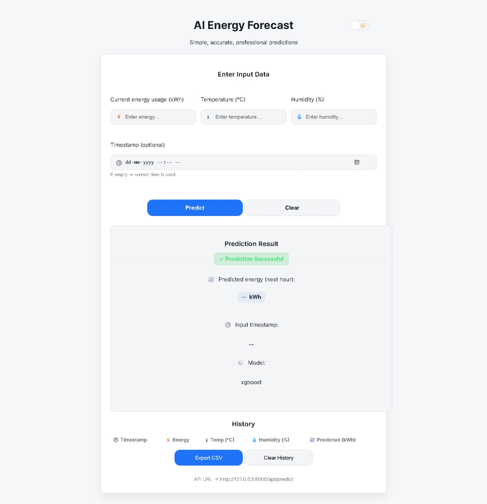
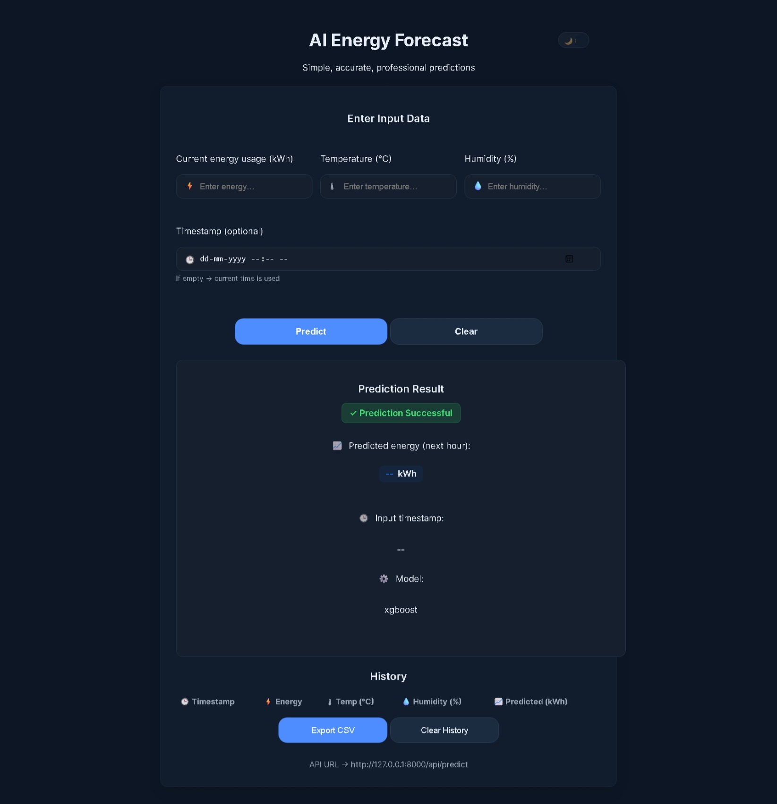
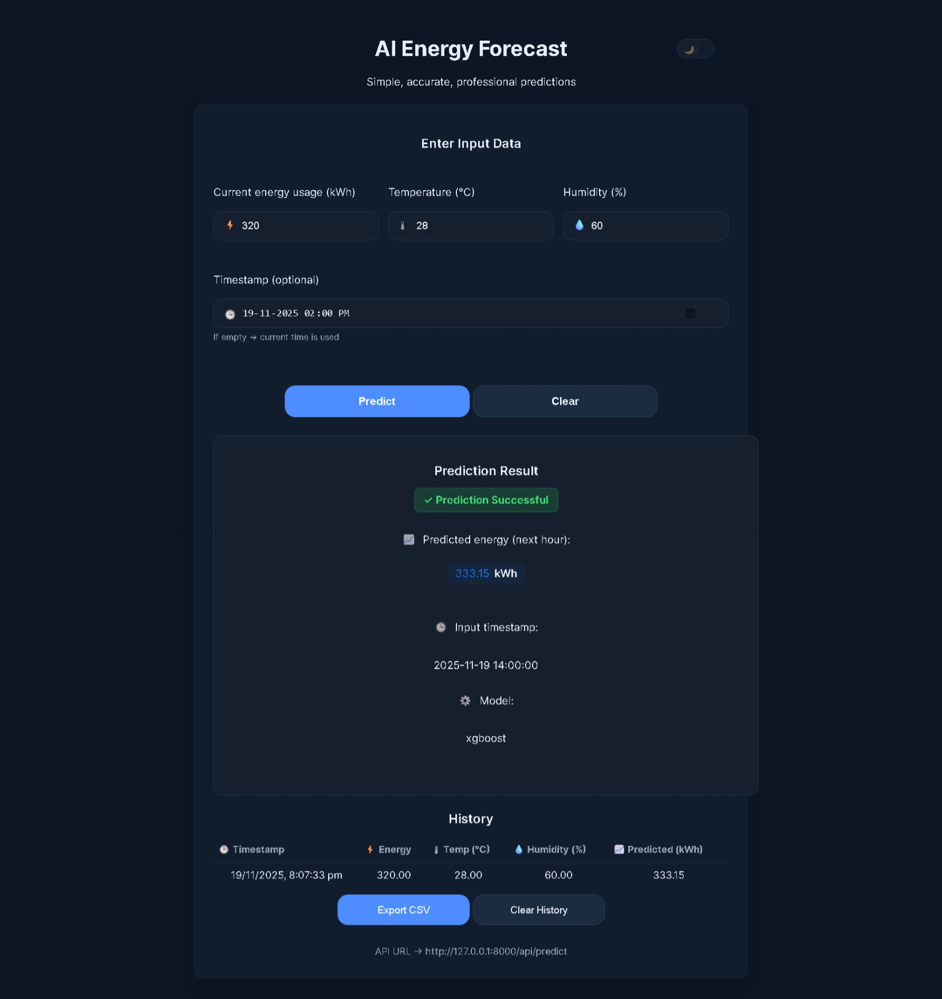

<p align="center">
  
</p>

---

# 🔋 **AI Energy Forecasting System**
A complete end-to-end **Energy Forecasting Application** featuring:

* 🧠 **Machine Learning model (XGBoost / MLP / LSTM)**
* 🌐 **Flask API backend**
* 💻 **Responsive Web Frontend** with Dark/Light theme
* 📊 **Feature engineering pipeline**
* 📁 Full project structure with **EDA, notebooks, datasets, and saved models**

This system predicts **next hour energy usage (kWh)** and provides a clean UI with history, CSV export, timestamp input, and visual organization.

---

# 🏷️ Badges


<p align="center">
  <b>🔥 AI-Powered Energy Forecasting System | Machine Learning • Flask API • Modern Frontend • End-to-End Project</b>
</p>

---

## 📸 Screenshots


### 🌞 UI – Light Mode



### 🌙 UI – Dark Mode



### 📈 Prediction Output



---

## 🚀 Features

### 🧠 **Machine Learning**

* Model trained using:

  * XGBoost
  * MLP
  * LSTM

* Feature-engineered inputs
* Cleaned datasets
* Saved best model (`best_model.pkl`)

### 🧮 **Flask Backend**

* `/api/predict` endpoint
* Handles timestamps
* Returns predicted kWh + model used
* Handles missing timestamp gracefully

### 💻 **Frontend UI (HTML + CSS + JS)**

* Inputs for:

  * Current Energy (kWh)
  * Temperature (°C)
  * Humidity (%)
  * Timestamp (optional)

* Shows prediction like: **320 kWh**
* Success animation
* Fully centered modern UI
* Dark/Light toggle

### 🗃 **History System**

* Saves past predictions
* Export CSV
* Clear History option

### 📊 **Data Pipeline**

* Raw → Cleaned → Feature-Engineered
* Stored in `/data` with clear organization
* Jupyter notebooks for:

  * EDA
  * Feature engineering
  * Model building

---

## 📂 Project Structure

```

ENERGY-FORECASTING/
│── app/
│   └── energy_app.py
│
│── data/
│   ├── features/
│   │   ├── features_LSTM.csv
│   │   ├── features_MLP.csv
│   │   └── features_XGBOOST.csv
│   │
│   ├── processed/
│   │   ├── cleaned_energy_data.csv
│   │   └── feature_engineered_energy_data.csv
│   │
│   └── raw/
│       └── energy_data.csv
│
│── frontend/
│   ├── index.html
│   ├── style.css
│   └── control.js
│
│── models/
│   └── best_model.pkl
│
│── notebooks/
│   ├── 01. EDA.ipynb
│   ├── 02. Feature Engineering.ipynb
│   └── 03. Modelling.ipynb
│
│── tests/
│   └── test_api.py
│
│── requirements.txt
└── README.md

```

---

## ⚙️ Installation & Setup

### **1️⃣ Clone the repository**

```sh
git clone https://github.com/girishshenoy16/AI-Energy-Forecasting-System.git
cd AI-Energy-Forecast
````

---

### **2️⃣ Create a virtual environment**

```sh
python -m venv venv
source venv/bin/activate   # Mac/Linux
venv\Scripts\activate      # Windows
```

---

### **3️⃣ Install dependencies**

```sh
python.exe -m pip install --upgrade pip
pip install -r requirements.txt
```

---

### **4️⃣ Run the Flask API**

```sh
python .\app\energy_app.py
```

Server will start at:

```
http://127.0.0.1:8000
```

---

### **5️⃣ Open the Frontend**

Open:

```
frontend/index.html
```

Your UI will communicate with the Flask API automatically.

---

## 📡 API Usage

### **POST /predict**

#### Sample Request

```json
{
  "current_energy": 320,
  "temperature": 28,
  "humidity": 60,
  "timestamp": "2025-11-19 14:00"
}
```

#### Sample Response

```json
{
  "prediction": 333.15,
  "timestamp_used": "2025-11-19 14:00",
  "model": "xgboost"
}
```

---

## 📈 Future Improvements

* Deploy backend (Render / AWS / Railway)
* Add live charts
* Compare multiple ML models
* Add user authentication
* Implement batch forecasting
